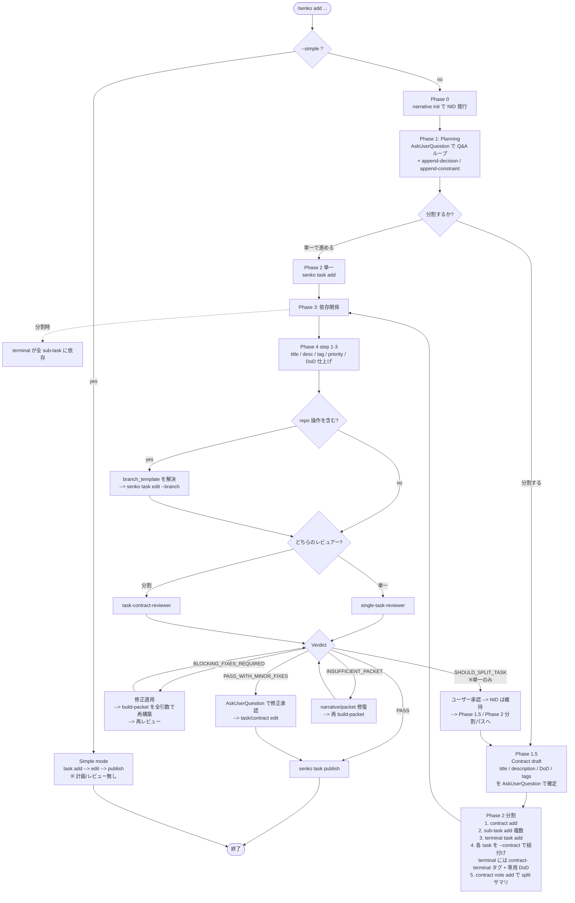
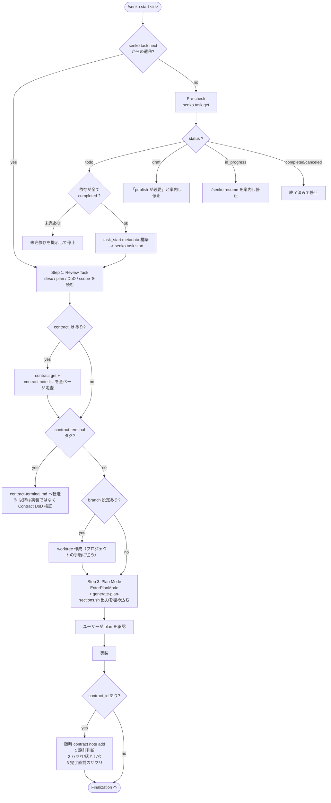

## 概要

senko skill（`.claude/skills/senko/`）の主要 2 フロー — タスク追加 (`/senko add`) と
タスク実行 (`/senko start <id>`) — の内部分岐をまとめる。skill 内の実装が分散している
（`SKILL.md` ルーティング、`workflows/add-task.md`、`workflows/execute-task.md`、
`workflows/contract-terminal.md` など）ため、全体像を 1 枚で把握する用途。

> `/senko resume <id>` は `in_progress` の再開専用で、ここでは扱わない。

## `/senko add <description>` のフロー

主な分岐:

- **`--simple`**: planning / reviewer / Phase 0 narrative を全部スキップ。
- **split 判定**（Phase 1 末）: split する場合のみ Contract と terminal task が生成される。
- **branch 設定**（Phase 4 step 4）: repo 操作の無いタスク（調査だけ等）は branch を付けない。
- **reviewer 種別**: Contract の有無で `single-task-reviewer` / `task-contract-reviewer` に分岐。
- **Verdict 5 種**:
  - `PASS` — そのまま publish
  - `PASS_WITH_MINOR_FIXES` — ユーザー承認の修正だけ当てて publish
  - `BLOCKING_FIXES_REQUIRED` — 修正 → packet 再構築 → 再レビューのループ
  - `SHOULD_SPLIT_TASK`（単一パスのみ） — NID を維持したまま Phase 1.5 / 分割 Phase 2 へ転回
  - `INSUFFICIENT_PACKET` — narrative / packet を修復して再ビルド

## `/senko start <id>`（タスク実行）のフロー

主な分岐:

- **`task next` 経由かどうか**: 経由なら Pre-check / `task start` をスキップして即 Step 1 へ。
- **status / 依存ガード**: `todo` でかつ全依存 completed のときのみ実行可。それ以外は理由を出して停止（`in_progress` だけは `/senko resume` を案内）。
- **contract_id**: 設定されていれば Contract 本体と全 note を実行前に読み込み、実装中も note を追記。
- **`contract-terminal` タグ**: 以降の標準ワークフローを踏まず `contract-terminal.md`（Contract DoD 検証 + 不足分の follow-up タスク作成）に切り替わる。
- **branch**: 設定があれば worktree を切る（プロジェクトの手順に従う）。無ければ worktree 作成自体をスキップ。

## 参照

- `.claude/skills/senko/SKILL.md` — ルーティング規則
- `.claude/skills/senko/workflows/add-task.md` — `/senko add` のフェーズ詳細
- `.claude/skills/senko/workflows/execute-task.md` — `/senko start <id>` のステップ詳細
- `.claude/skills/senko/workflows/contract-terminal.md` — terminal task の検証ワークフロー
- `.claude/skills/senko/workflows/resume-task.md` — `/senko resume <id>` の再開ワークフロー
